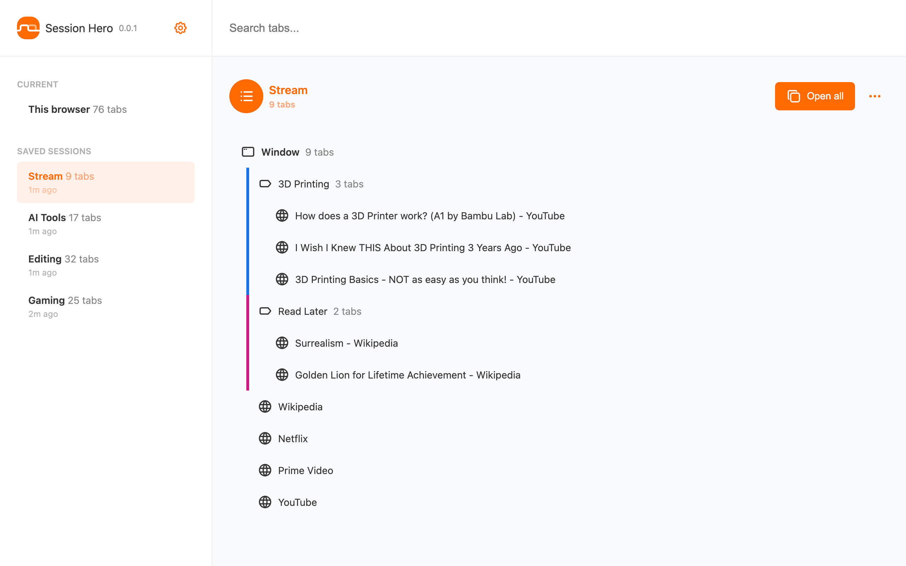

# Session Hero

Simplify Your Browsing Experience

Session Hero is a powerful *Chrome extension* tab manager designed to help you stay organized and productive while browsing. With advanced features and intuitive controls, it's the perfect tool for taming tab chaos.

## Installation

## Screenshots

## Features

- Save and Organize Tabs, Tab Groups and Windows: Group your open tabs into collections for easy restoration later.
- Tab Group Support: Group tabs into categories within collections for even greater organization and efficiency.
- Import and Export: Quickly import and export your tabs, tab groups and windows.
- Unified Tab View: Manage all your open tabs, tab groups and windows from a single dashboard.
- Lightning-Fast Search: Locate saved items and open them instantly.

Ready to revolutionize your browsing experience? Try Session Hero today and discover the difference!

## Development

This project includes React and ReactDOM via script tags. No build tools, no npm run, no build—just elbow grease.

To test immediately, zip everything, go to Chrome > Extensions, and click "Load unpacked".

To make it publish-ready, go to Chrome > Extensions and click "Pack extension".

## License

This project is licensed under the MIT License